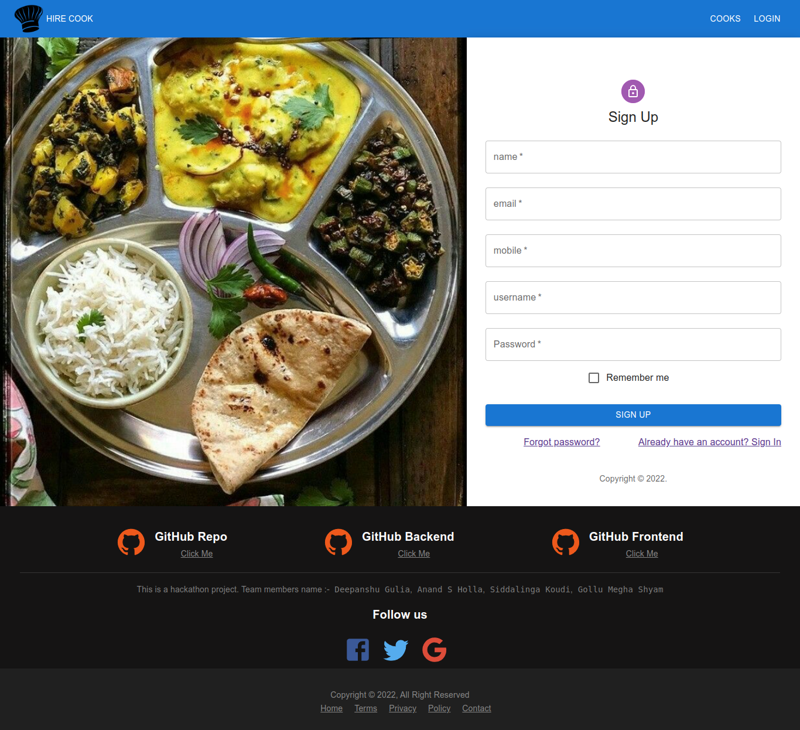
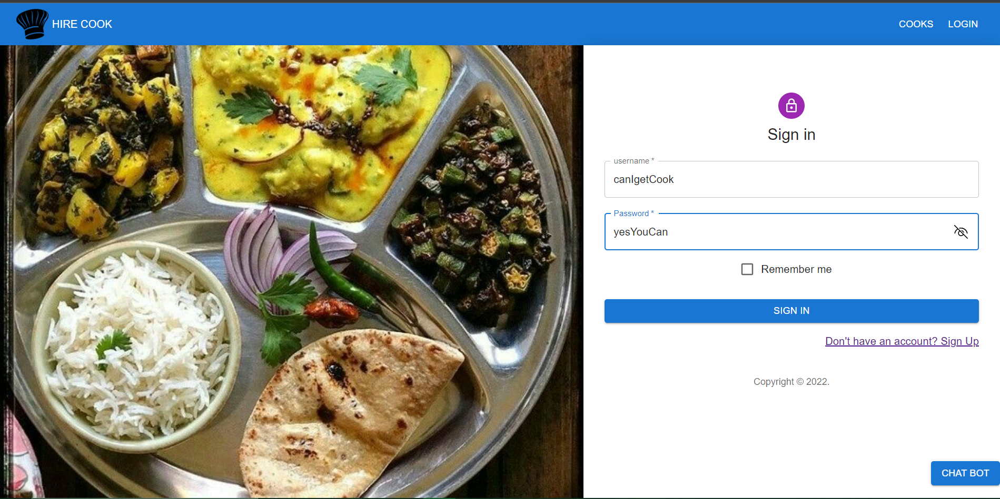
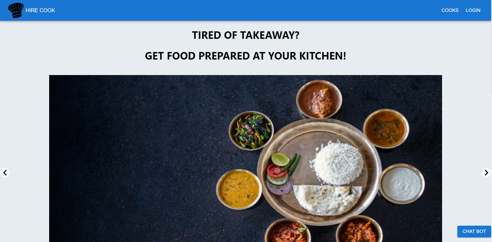
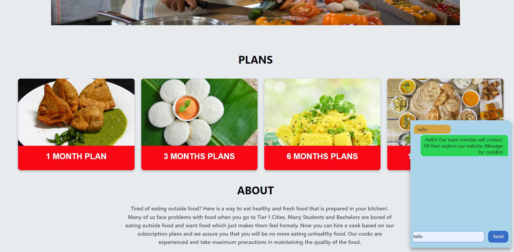
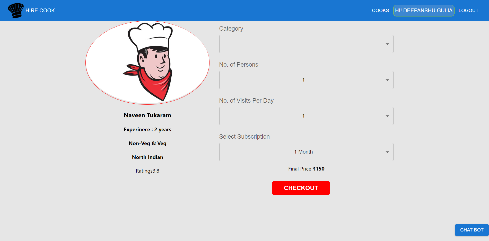
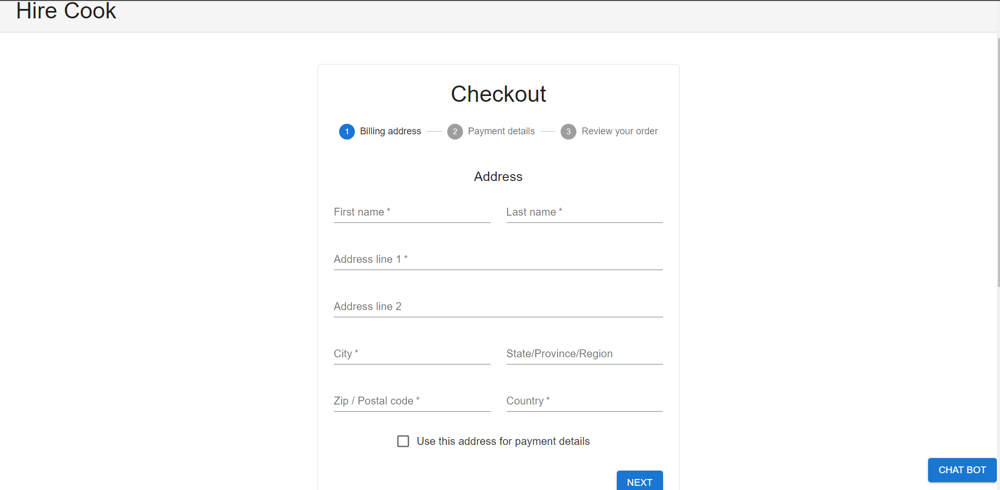

# Hire-A-Cook
<br>
Chefholic-Hire a Chef at your Doorstep
# About the Webapp
## This Webapp is about hiring a cook based on our subscription plans. Now you can get food prepared at your kitchen from our cooking chefs.
<br>

# Features

* ##  SignUp

<br>

* ##  Login 

<br>

* ##  Home

<br>

* ##  Subscription Plans

<br>

* ##  Cooking Chef's Page

<br>

* ##  Booking Page

<br>

* ##  Checkout Page

<br>

<hr>

## TechStacks
* React
* Redux
* Material UI
* Socket.io
* MongoDB
* ExpreeJS
* NodeJS
* JavaScript
* CSS
* Heroku
* Vercel

<br>

### Deployed Link:-
```


```


